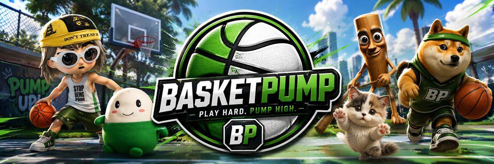

# BASKETPUMP

**PLAY HARD. PUMP HIGH.**

A fast, fun, arcade-style 2D basketball brawler — **side-view, two hoops, team vs team** (BasketBros-style). Street basketball aesthetic with a modern esports look.



## Features

- **Side-view arena** with a hoop on a pole at each end, animated nets, wooden floor, night-arena backdrop
- **3v3** — you + 2 AI teammates vs 3 AI opponents, full game loop with scoring & resets
- **Physics**: gravity, jumping, ballistic shots, rim/pole/backboard bounces, loose-ball scrambles
- **Controls**
  - `A` / `D` — move
  - `W` — jump
  - `E` (or right-click) — grab loose ball / steal
  - `Q` — pass to nearest teammate
  - `Hold Space` (or hold left-click) — charge shot · **release** to shoot
- **Shot skill curve** — perfect charge ≈ 90–100% from range; weak charge bricks. Easy to learn, hard to master.
- **HUD** — scoreboard, match timer, vertical charge rail, stamina bar, "YOU HAVE THE BALL" pill, contextual prompts
- **Match modes** — Quick / Ranked / Practice · 3 / 5 / 7 minutes

## Tech

- Vite + TypeScript, HTML5 Canvas 2D renderer
- Procedural Web Audio SFX (shoot, swish, rim, dribble, steal, whistle) + crowd ambience
- Zero backend — fully client-side static site, deployed on Vercel

## Develop

```bash
pnpm install
pnpm dev      # http://localhost:5173
pnpm build    # outputs to dist/
pnpm preview
```

## Roadmap

- Online multiplayer (Socket.io) — architecture is network-ready
- Progression: coins, XP, trophies; cosmetic unlocks (jerseys, courts, emotes, ball skins)
- Tournaments & leagues

